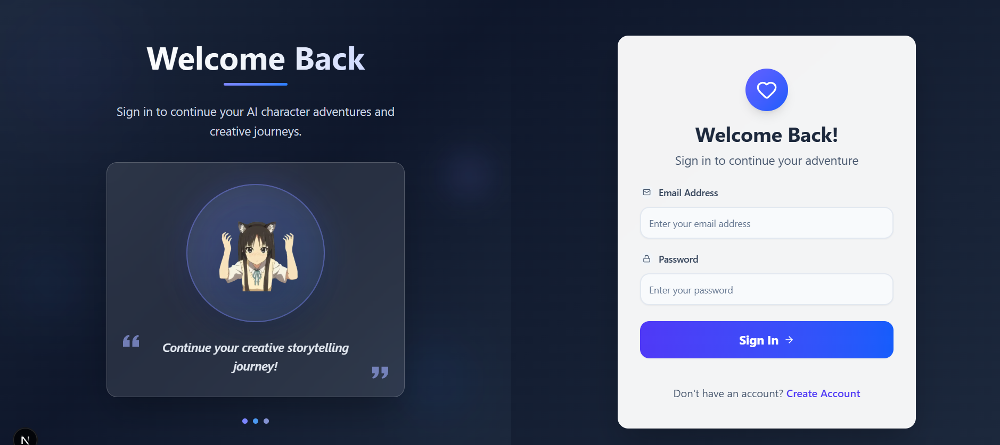
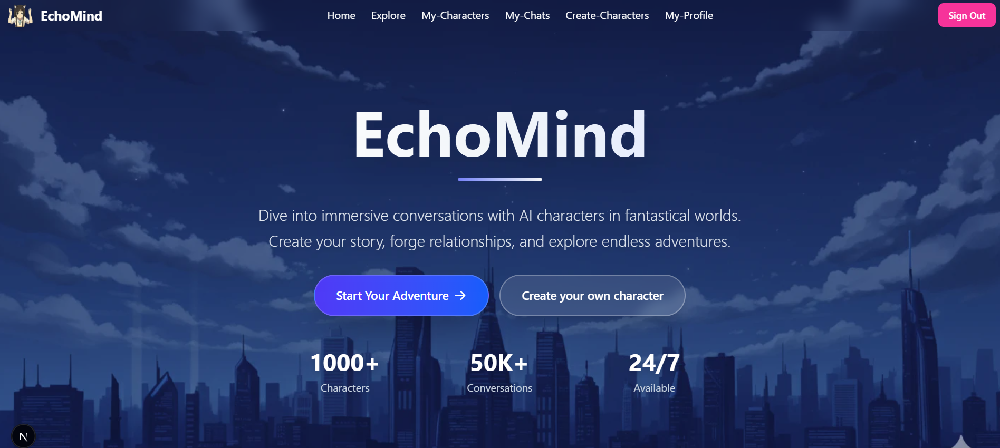
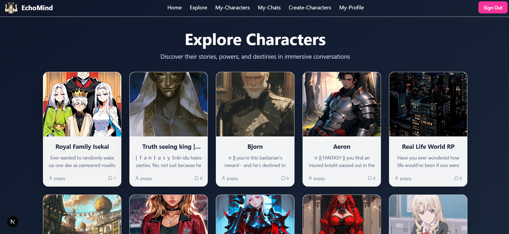
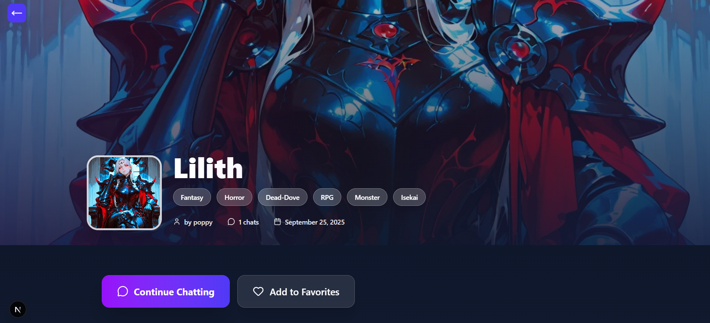
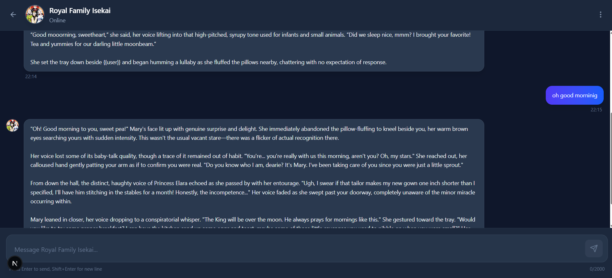
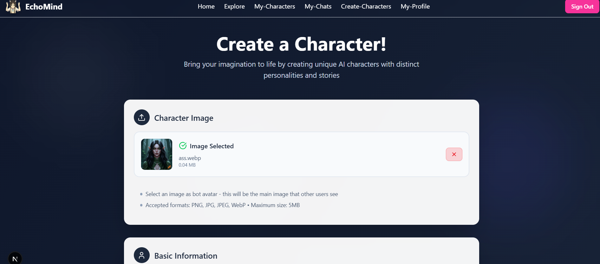
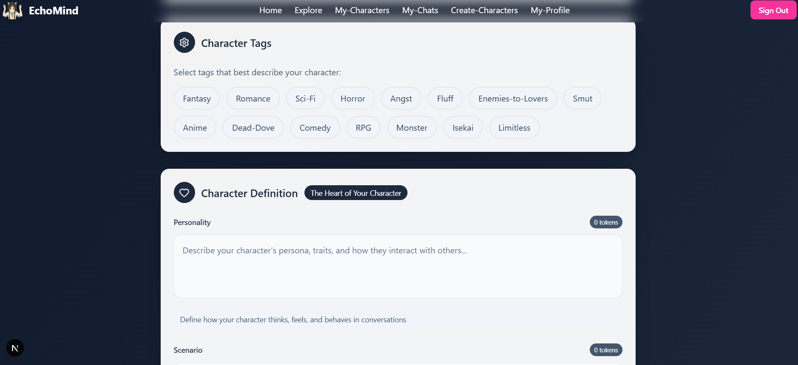
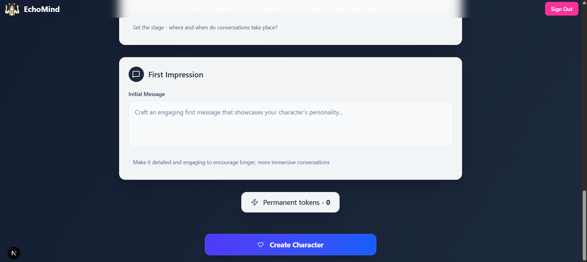

# Echomind

Echomind is a **full-stack AI-powered character chat and management platform** that allows users to create, explore, and interact with AI characters in real-time. It serves as a creative and interactive platform where users can develop their own characters, chat with them, and manage conversations efficiently.

---

## Features

1. **User Authentication**  
   - Secure sign-in using **NextAuth.js** with credentials provider.  
   - Passwords hashed with **bcrypt**.  
   - ZOD validation useed.

2. **Character Management**  
   - Create, view, and manage AI characters.  
   - Upload profile photos and add descriptions, personality, scenario, initial messages, and tags.  
   - Images stored in cloudinary.
   - Edit or delete characters.  

3. **Conversations**  
   - Using DS V3.1 for AI conversations.

4. **Explore Characters**  
   - Browse all characters with pagination and search functionality.  
   - View character details including creator, description, tags, and chat count.  

5. **Responsive UI**  
   - Built using **Tailwind CSS** for fully responsive designs across devices.  
   - Smooth hover effects, modals, and transitions.  

6. **State Management & Caching**  
   - Uses **Zustand** for caching user’s characters to minimize repeated API calls.  
   - Cache invalidation occurs when characters are created, edited, or deleted.  

---

## Technologies Used

- **Frontend**:  
  - React.js  
  - Next.js 13 (App Router)  
  - Tailwind CSS  
  - Lucide React (icons)  

- **Backend**:  
  - Node.js & Express (API handling)  
  - Prisma ORM  
  - PostgreSQL (database)  

- **Authentication & Security**:  
  - NextAuth.js with Credentials Provider  
  - JWT for session management  
  - Bcrypt for password hashing  

- **Real-Time Communication**:  
  - Socket.io  

- **State Management**:  
  - Zustand (for caching characters and chat state)  


 **Clone the repository**  

```bash
git clone https://github.com/yourusername/echomind.git
cd echomind

# Install dependencies 
npm install

```

# 📸 Some Example Screenshots

### Signin Page


### Landing Page


### Explore Page


### Character Page


### Chat Page


### Create Character Page





# .env.example
- DATABASE_URL=
- BCRYPT_SALT_ROUNDS=10
- NODE_ENV=

- NEXTAUTH_URL=
- NEXTAUTH_SECRET=

- CLOUDINARY_CLOUD_NAME=
- CLOUDINARY_API_KEY=
- CLOUDINARY_API_SECRET=

- DEEPSEEK_API = 

- NEXT_PUBLIC_BASE_URL = 


### Future Enhancements

Implement AI-driven recommendations for characters to chat with.

Integrate image moderation and profile verification.

Add dark mode toggle.

Deploy a mobile-friendly PWA version for offline usage.

Better DockerFile